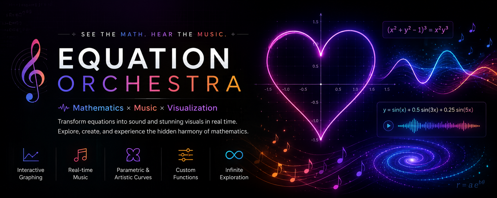
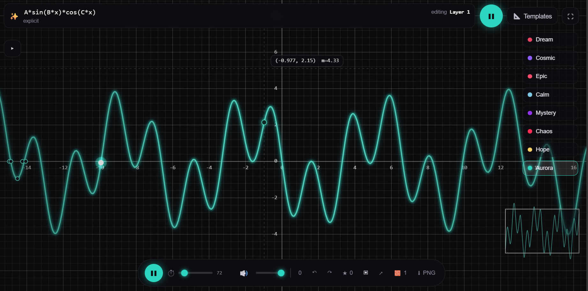
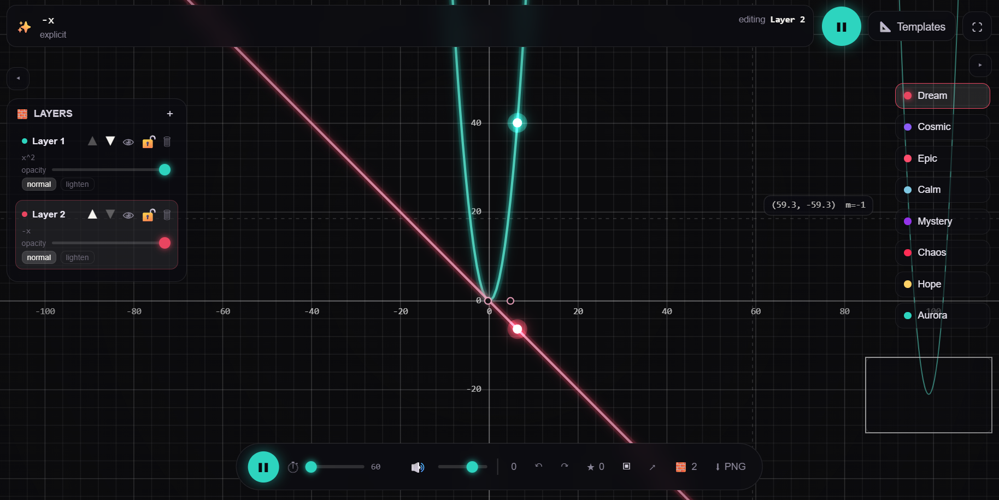

# 🎼 Equation Orchestra

<p align="center">
  
</p>

<p align="center">
  <strong>Turn Mathematics into Music.</strong><br>
  Visualize equations, hear their melodies, and explore the beauty hidden inside mathematics.
</p>

<p align="center">
  
  
  
  
</p>

---

## 🌟 Overview

Equation Orchestra is an interactive web application that transforms mathematical equations into immersive visual and musical experiences.

Every equation is rendered as a beautiful interactive graph while simultaneously generating evolving melodies based on its mathematical behavior. Explore sine waves, Fourier series, harmonic functions, artistic curves like hearts, roses, butterflies, and even your own custom equations—all while watching and hearing mathematics come alive.

---

## ✨ Features

### 📈 Interactive Graph Visualization

- Real-time graph plotting
- Smooth zoom & pan
- Adaptive curve rendering
- High-performance Canvas rendering
- Infinite graph exploration
- Oscilloscope-inspired curve generation

<p align="center">

</p>

---

### 🎵 Equation → Music

Every equation produces a completely different musical experience.

The application maps mathematical properties such as:

- Position
- Curvature
- Slope
- Frequency
- Amplitude

into dynamic musical parameters.
---

### ❤️ Beautiful Mathematical Shapes

Generate artistic equations including:

- ❤️ Heart
- 🍀 Clover
- ☀️ Sun
- ⚙️ Gear
- ♾️ Infinity
- ❄️ Snowflake
- 🦋 Butterfly

or create your own custom equations.

---

## 🚀 Demo

Live Demo: https://mouli-dutta.github.io/Equation-Orchestra/

---

## 🎼 Supported Equations

## Supported Equations

Equation Orchestra uses [mathjs](https://mathjs.org/) to parse whatever you type into the equation bar, and automatically detects which of the forms below you're using — no need to specify the type manually.

### Explicit — `y = f(x)`
The most common form. The `y =` prefix is optional.

```
A*sin(B*x+C)
A*x^B
sin(x) + 0.5*sin(2*x) + 0.25*sin(3*x)
```

Any letter other than `x` (e.g. `A`, `B`, `C`) is automatically detected and exposed as an adjustable slider.

### Implicit — `f(x, y) = g(x, y)`
Any equation containing `=` that isn't a `y=`, `x=`, or `r=` line. Closed implicit curves (shapes that loop back on themselves) get a traveling glowing playhead and become a continuous, looping musical voice.

```
(x*x+y*y-1)^3 = x*x*y^3        # heart
(x*x+y*y)^2 = 2*(x*x-y*y)      # lemniscate
sqrt(x*x+y*y) = 1+0.2*cos(6*atan2(y,x))   # snowflake-style rose
```

### Polar — `r = f(theta)`

```
r = 1+0.3*sin(5*theta)
r = 1 + 0.2*cos(6θ)
r = 1 + 0.1*sin(12θ)*cos(6θ)
```

### Syntax reference

| Category | Supported |
|---|---|
| Operators | `+ - * / ^`, implicit multiplication (`2x`, `A sin(x)`) |
| Functions | `sin cos tan asin acos atan atan2 sinh cosh tanh sqrt cbrt abs exp log ln floor ceil round min max pow mod sign clamp` |
| Constants | `pi tau phi e` |
| Absolute value | `\|x\|` → converted to `abs(x)` |
| Unicode shortcuts | `π → pi`, `θ → theta`, `² ³ ⁴ → ^2 ^3 ^4`, `≥ ≤ ≠ → >= <= !=` |

Invalid equations show an inline parse error under the equation bar instead of crashing the app.

---

## Layers

Equation Orchestra supports stacking up to **4 equations at once** as independent layers, each with its own math, mood, and audio voice — letting you build a composite visual and musical scene from multiple curves playing together.

<p align="center">

</p>

### What each layer has

- **Its own equation** — any of the supported forms (explicit, implicit, parametric, polar, piecewise), evaluated independently.
- **Its own parameters** — sliders for detected variables are scoped per layer, so `A` on Layer 1 is unrelated to `A` on Layer 2.
- **Its own mood** — each layer can be assigned a different emotion (Dream, Cosmic, Epic, Calm, Mystery, Chaos, Hope, Aurora), which controls its color palette, instrument, and musical scale independently.
- **Its own playhead and audio voice** — closed curves get their own glowing playhead and endless musical loop; open curves get their own note sequence. All active layers play simultaneously, layered into one composition.

### Managing layers

- **Add** a layer with the `+` button in the Layers panel (up to 4). New layers default to an unused mood so they're visually distinct from existing ones.
- **Select** a layer by clicking it in the list — the equation bar, parameter sliders, and mood picker all edit whichever layer is currently active.
- **Reorder** layers with the ▲ / ▼ controls; draw order follows layer order, with later layers painted on top.
- **Show/hide** a layer independently with the eye icon — hidden layers stop rendering and stop generating sound.
- **Lock** a layer with the lock icon to prevent accidental edits to its equation or parameters while you work on others.
- **Opacity** — each layer has its own opacity slider for blending it into the scene.
- **Blend mode** — toggle between `normal` and `lighten` per layer; `lighten` uses additive blending, great for stacking glowing curves without muddying colors.
- **Remove** a layer with the trash icon (at least one layer must always remain).

### Why layer at all

Layering lets you combine, for example, a slow ambient background wave with a fast chaotic spiral on top, each in a different mood, and hear/see them as one evolving piece rather than switching between equations one at a time.

---

## 🎵 How Music is Generated

Each graph is converted into sound by mapping mathematical properties to audio parameters.

| Mathematical Property | Audio Mapping |
|-----------------------|---------------|
| Y Value | Pitch |
| X Position | Stereo Position |
| Slope | Volume |
| Curvature | Filter |
| Oscillation | Tempo |
| Frequency | Melody |

Every equation produces a unique soundscape.

---

## 🛠 Tech Stack

- HTML5
- CSS3
- JavaScript (ES6)
- Canvas API
- Web Audio API
- Math.js

---

## 📂 Project Structure

```
Equation-Orchestra
│
├── assets/
│   ├── main_banner.png
│   ├── graph.png
│   ├── layer.png
│
├── index.html
└── README.md
```

---

## 💡 Future Roadmap

- [ ] MIDI Export
- [ ] AI-generated equations
- [ ] More instruments
- [ ] 3D graph mode
- [ ] Spatial audio
- [ ] Audio recording
- [ ] Shareable compositions
- [ ] Equation marketplace
- [ ] Community presets
- [ ] Mobile gestures
- [ ] Physics-based particles
- [ ] Shape morphing

---

## ⚡ Installation

Clone the repository

```bash
git clone https://github.com/mouli-dutta/Equation-Orchestra.git
```

Navigate to the project

```bash
cd Equation-Orchestra
```

Open

```text
index.html
```

---

## 🤝 Contributing

Contributions are always welcome!

1. Fork the repository
2. Create your feature branch

```bash
git checkout -b feature/AmazingFeature
```

3. Commit your changes

```bash
git commit -m "Add Amazing Feature"
```

4. Push

```bash
git push origin feature/AmazingFeature
```

5. Open a Pull Request

---

## ⭐ Support

If you enjoyed this project, consider giving it a ⭐ on GitHub.

It helps others discover the project and motivates future development.

---

## 📜 License

This project is licensed under the MIT License.

---

<p align="center">

### 🎵 Mathematics has never sounded this beautiful.

Made with ❤️ using JavaScript

</p>
